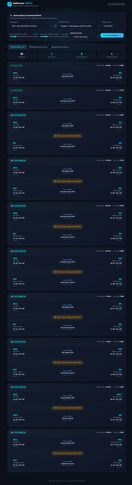

# 🚆 RailConnect

A smart railway route planner that helps users find direct and connecting train options with realistic transfer timing.


---

## 📌 Overview

RailConnect is a web-based train routing system that searches for both direct and indirect routes. It evaluates transfer stations, waiting time between trains, and route ranking to suggest practical travel plans.

---

## 📸 Project Preview



---

## ✨ Features

- **Real-Time Signal & Train Control Dashboard**: Obsidian dark-mode telemetry interface with interactive node schematic canvas, junction switches, and emergency overrides.
- **Conflict Resolver**: Alert card identifying track signal overlaps with one-click rerouting and signal hold actions.
- **Indirect & Direct Route Search**: Find direct and 1-stop connecting train routes across 22 major junctions including **Kalaburagi (Gulbarga)**, **Vijayapura (Bijapur)**, **Belagavi**, **Mysuru**, and **Bengaluru (KSR, Yesvantpur, SMVT)**.
- **Transfer Layover Buffer Control**: Configurable transfer buffer windows ($\Delta t_{min}$ to $\Delta t_{max}$) with day-of-week operation validation.
- **Multi-Criteria Ranking**: Sort options by fastest journey duration, shortest layover, lowest fare, or earliest arrival.

---

## 🛠️ Tech Stack

- **Frontend**: React 18, Tailwind CSS v4, Lucide Icons, Canvas & SVG Schematic
- **Backend**: Python 3.10+, FastAPI, SQLite
- **Testing**: Pytest

---

## 📂 Project Structure

```text
train_routing/
├── backend/
│   ├── app.py
│   ├── database.py
│   ├── routing_engine.py
│   └── seed_data.py
├── static/
│   ├── index.html
│   ├── styles.css
│   └── app.js
├── test_routing.py
├── requirements.txt
├── run.py
└── README.md
```

---

## ⚙️ Quick Start

```bash
git clone https://github.com/Mahantesh2006/train_routing.git
cd train_routing
pip install -r requirements.txt
python backend/seed_data.py
python run.py
```

Then open: http://localhost:8000

---

## 🧪 Testing

```bash
pytest test_routing.py
```

---

## 🚀 Deploy on Render

[](https://render.com/deploy?repo=https://github.com/Mahantesh2006/train_routing)

### Render Configuration Parameters:

1. **Sign in** to [render.com](https://render.com/) with GitHub.
2. Click **New +** $\rightarrow$ **Web Service** $\rightarrow$ Connect `Mahantesh2006/train_routing`.
3. Set the parameters:
   - **Environment**: `Python 3`
   - **Build Command**: `pip install -r requirements.txt && python backend/seed_data.py`
   - **Start Command**: `gunicorn -w 2 -k uvicorn.workers.UvicornWorker backend.app:app`
4. Click **Create Web Service**.


---

## 🤝 Contributing

Contributions are welcome. Feel free to fork the repository and submit a pull request.

5. Open a Pull Request.

---

## 📄 License

This project is licensed under the MIT License.

---


<p align="center">
⭐ If you like this project, don't forget to star the repository!
</p>
