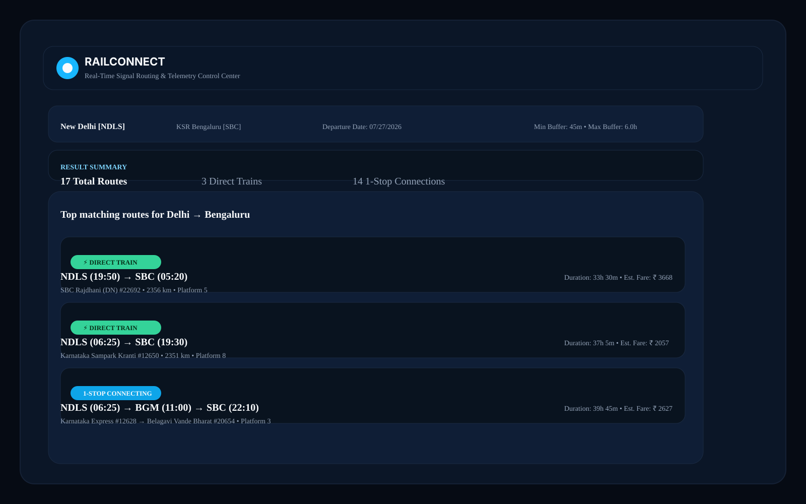

# 🚆 RailConnect

A clean and modern railway routing platform with a real-time control-room style dashboard for exploring train journeys and signal status.


## 🌐 Live Demo

Visit: https://train-routing-two.vercel.app

## 📸 Screenshots

### Live Dashboard Overview


### Delhi → Bangalore Route Search



## ✨ What this project does

RailConnect helps users find train routes between major railway hubs, compare travel options, and view a dark-mode control-room dashboard for monitoring routing and signal-related information.

## 🔧 Key Features

- Route planning between major Indian railway hubs
- Transfer buffer and layover-aware routing logic
- Dark-mode control room dashboard experience
- Conflict and reroute suggestions in the UI
- FastAPI + React-based web application

## ▶️ Quick Start

```bash
git clone https://github.com/Mahantesh2006/train_routing.git
cd train_routing
pip install -r requirements.txt
python backend/seed_data.py
python run.py
```

Open http://localhost:8000 in your browser.

## 🛠️ Tech Stack

- Backend: Python, FastAPI, SQLite
- Frontend: React, Tailwind CSS
- Deployment: Vercel
- Testing: Pytest

## 📁 Project Structure

```text
train_routing/
├── api/
├── backend/
├── static/
├── test_routing.py
├── requirements.txt
├── run.py
└── README.md
```

## 🧪 Testing

```bash
pytest test_routing.py
```

## 📄 License

This project is licensed under the MIT License.

⭐ If you like this project, please consider starring the repository.
